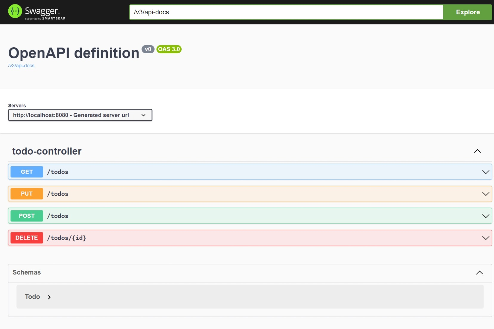

# Todo API

### API REST de to-dos

Índice
=================

   * [Preview](#Preview)
   * [Como usar](#Como)
   * [Tecnologias](#Tecnologias)

# Preview

# Como usar

1. Tenha instalado a JDK 17 ou +;
2. Use uma IDE de sua preferência
3. Baixe o projeto e abra-o na pasta applicatio properties
4. Nela você precisa colocar seu login e senha para acessar o banco de dados
5. Crie o banco de dados todolist
6. Tenha certeza de que o banco de dados está em execução
7. Rode a aplicação
8. Para acessar a documentação swagger, digite - http://localhost:8080/swagger-ui.html

# Tecnologias
- ### Java
- ### Spring Boot 3
- ### Spring JPA
- ### Spring Web
- ### MySQL Driver
- ### Git e Github
